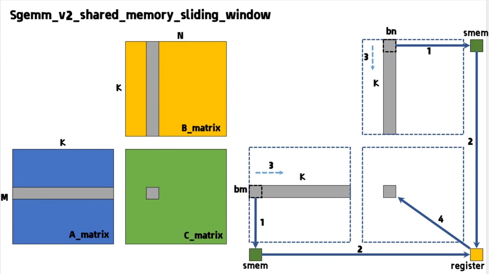
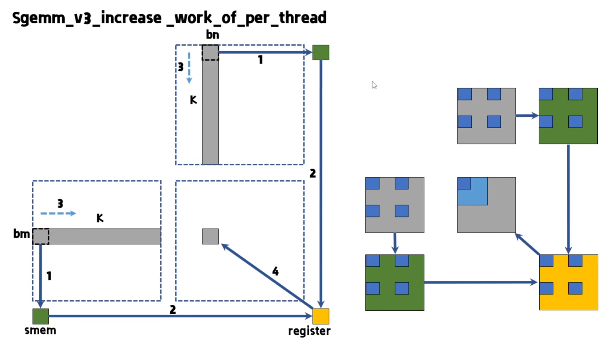
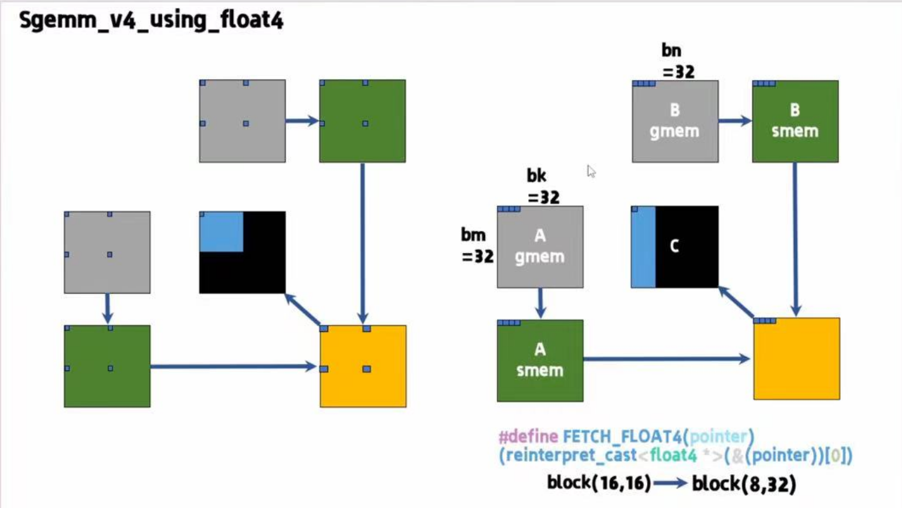
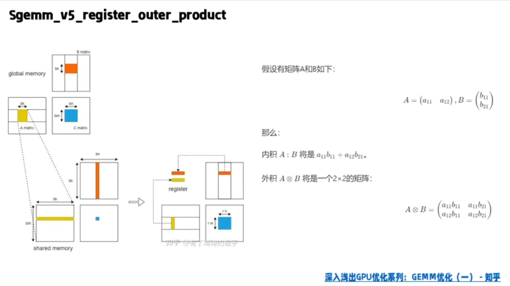
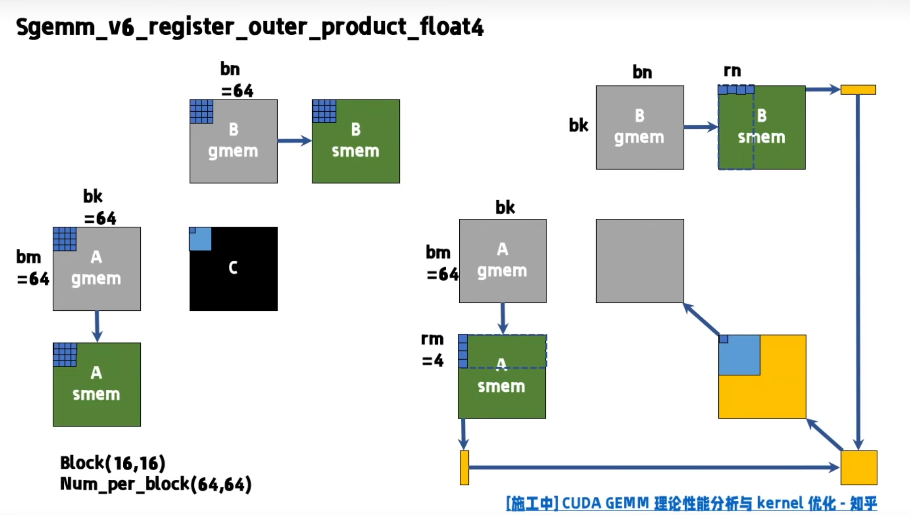
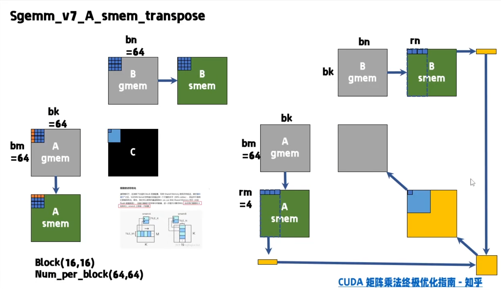
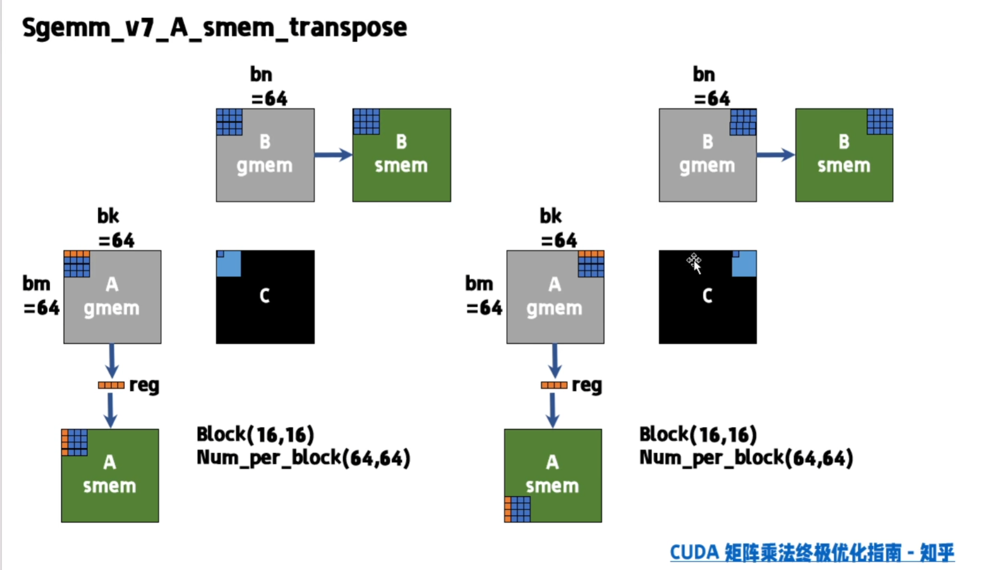
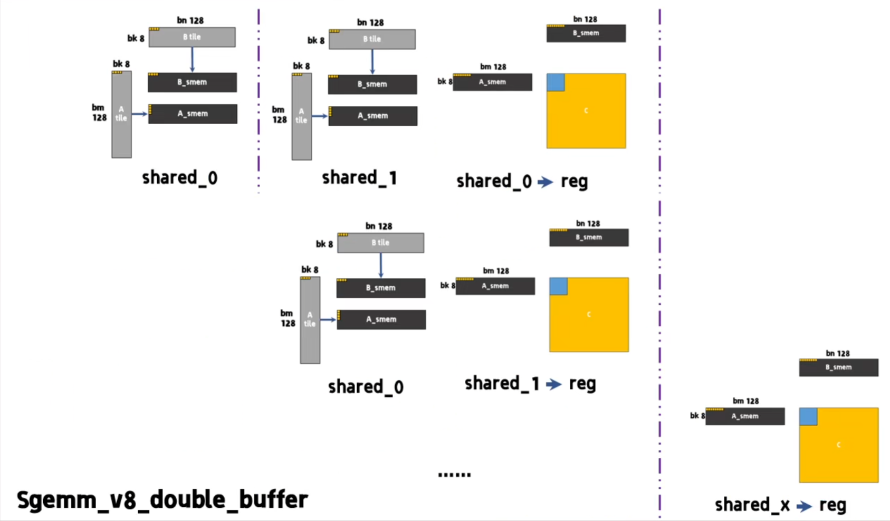

参考资料：cuda入门的正确姿势：how to optimize gemm
https://zhuanlan.zhihu.com/p/478846788
![[Pasted image 20241228151906.png]]

V0:
	![[Pasted image 20241228161307.png]]
	![[Pasted image 20241228162044.png]]
	**重复读取：**
	每次计算一个结果, 需要循环k次, 且这k次需要的元素全部要去global memory上读取, 而且在算C矩阵的[0, 0]和[0, 1]时, 其实需要的是A矩阵的同一行, 但是还是会重新取global memory上读取；
	read: 2 * M * N * K
	write: M * N
V1:
![[Pasted image 20241229131529.png]]
	使用shared_memory, 优化重复读取
	eg：
		把A矩阵的第0行存入shared_memory, 在计算C矩阵的[0, x]时, 全部可以直接去shared_memory寻找所需要的A矩阵的元素
		把B矩阵的第0列存入shared_memory, 在计算C矩阵的[x, 0]时, 全部可以直接去shared_memory寻找所需要的B矩阵的元素
	read: KNM * (1/bn + 1/bm)
	write: M * N
v2:

	v1的问题, 强行的将整个行/列全部塞入smem, 但是smem的大小是有限的(48KB/100KB),
	极大的限制了矩阵shape, 没有应用价值
	因此, 使用分块计算
v3:

	before: 不管是从Global还是Shared, 核心循环中的三条指令,
	两条load, 一条FMA -> 计算指令占比低(仅占1/3) -> 增加计算指令
	after: 四条load, 四条FMA -> 提高计算指令占比(占1/2)
v4:

	v3需要读取四个元素 -> 向量化
	v3的四个元素是离散的(stride: threadNum), 但是向量化读取要求是连续的2/4个元素
	v3的四个元素, 其实还是四条load指令, 从Global拿四次数据 ->
	向量化, 一次拿四个数(内存连续) -> 只有一条load指令
	TODO: 对B矩阵进行Transpose
v5:

	在v1以前, 存在严重的重复读取问题, 且数据均在Global上, 读取代价很大,
	v2引入Shared, 虽然还是要重复读取, 但是数据在Shared上, 读取代价变小,
	-> 再进一步, Shared -> Register, 进一步减少读取代价
	手动的写了两级Cache, 第一级: Global -> Shared 第二级: Shared -> Register
	1. 内积: 先遍历M, 后遍历N, 最后遍历K
		每次读一行, 一列, 相乘得出一个标量
		问题: K一直在变, 但是对于B矩阵来说, K是行, 每变一次, stride为N, 而不是1
		A: [M, K]   B: [K, N]
		for m from 0 to bm:
			for n from 0 to bn:
				for k from 0 to bk:
					C_tile[m][n] +=
						A_tile[m][k] * B_tile[k][n]
	2. 外积: 先遍历K, 后遍历M, 最后遍历N
		每次读一列, 一行, 相乘得出一块矩阵
		N一直在变, 对于B矩阵来说, N是列, 每变一次, stride为1, 连续,
		对于A矩阵来说, m, k在内层循环时每次都不变 -> 编译器会将其优化到Register中
		A: [M, K]   B: [K, N]
		for k from 0 to bK:
			for m from 0 to bm:
				for n from 0 to bn:
					C_tile[m][n] +=
						A_tile[m][k] * B_tile[k][n]

		A_frag, B_frag, C_frag: registers
		A_tile, B_tile, C_tile: shared_memory
		for k from 0 to bk:
			A_frag[rm] = A_tile[0 to rm][k]
			B_frag[rn] = B_tile[k][0 to rn]
			for m from 0 to bm:
				for n from 0 to bn:
					C_frag[m][n] += A_frag[m] * B_frag[n];
v6:

	在v5的基础上, 使用向量化进行读写, 增加每个thread的工作量(16个元素)
	TODO: 继续增加每个thread的工作量 -> 增加a/b_reg至Register最大值
v7:

	v6的不足: 在进行向量化读写时, 由于是外积, A矩阵要竖着读取 -> 无法向量化,
	因此对A进行转置, 竖着读 -> 横着读 -> 向量化

	问题: 转置带来的坐标变换
v8:

	A/B各分配两个Shared
	Global搬到A/B_shared_0 -> sync -> Global搬到A/B_shared_1 + 计算shared_0 -> sync
	-> Global搬到A/B_shared_0 + 计算shared_1 -> sync -> ...